# Animation Mapping

Hooklusion does not play raw hook events directly. It first converts activity into a smaller set of states that a character profile can animate consistently.

This guide explains the mapping in user terms.

Bundled preview GIFs for the default `gpchan-default` profile are committed under [`docs/public/media/gpchan-gif/`](./media/gpchan-gif/) so release docs can show each mapped animation directly.

## Bundled Preview Gallery

### Basic States

| State | What it means | Preview |
| --- | --- | --- |
| `idle` | resting pose when the character is visible but no active state has taken over yet | 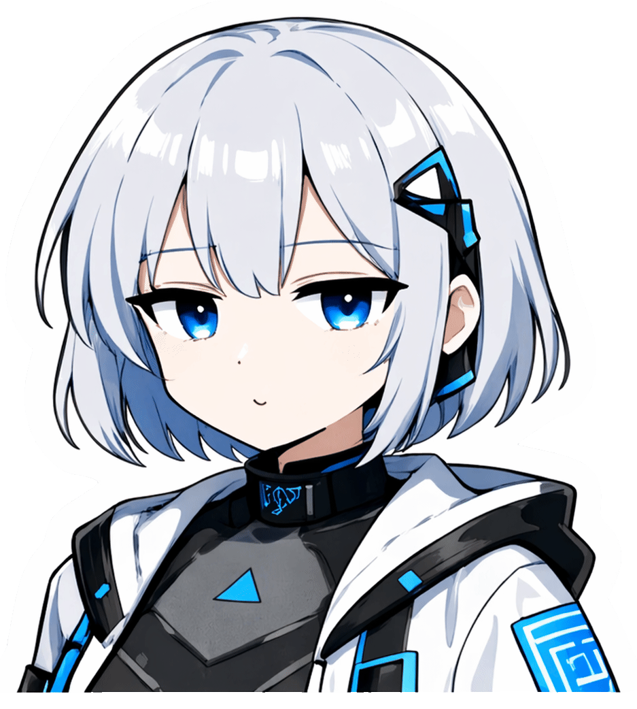 |
| `session_start` | a session has started or returned | 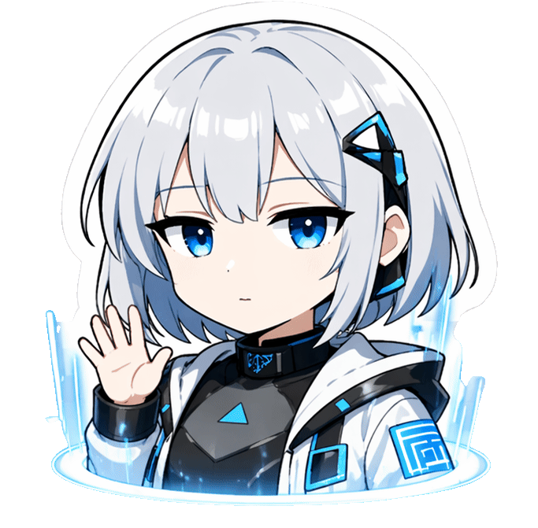 |
| `prompt_received` | your prompt was received | 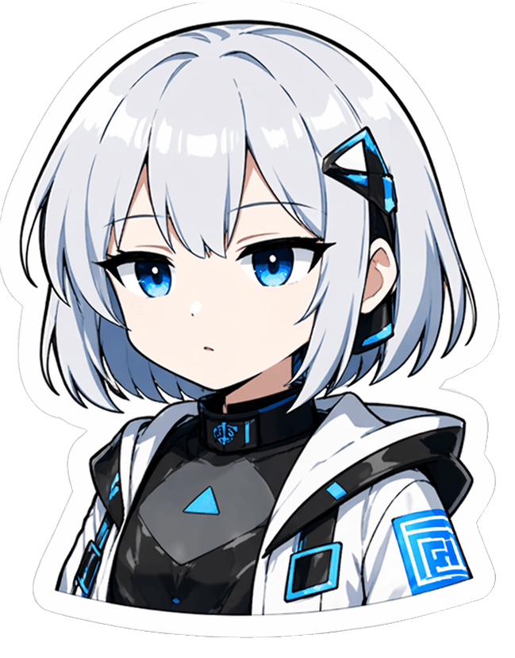 |
| `thinking` | the agent is waiting or reasoning between events | 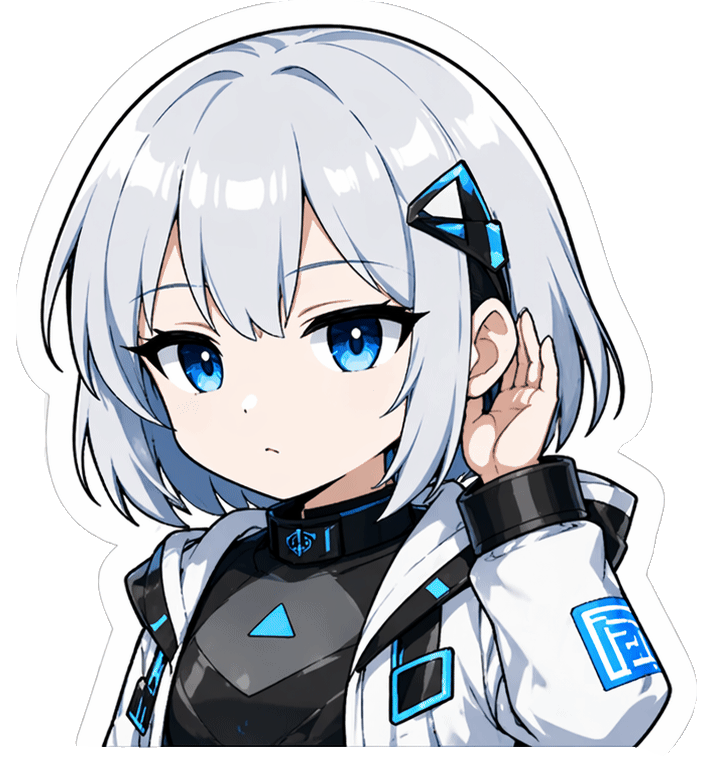 |
| `tool_active` | some tool is currently doing work |  |
| `done` | the turn completed | 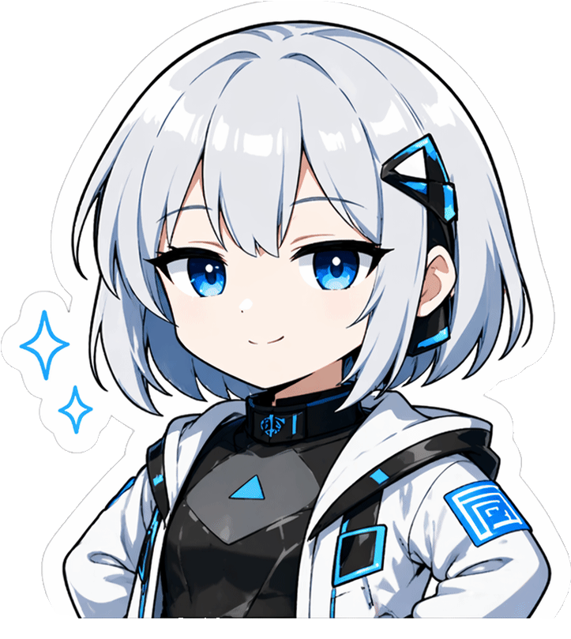 |

### Tool-Specific States

| State | Typical meaning | Preview |
| --- | --- | --- |
| `tool_read` | reading files or content | 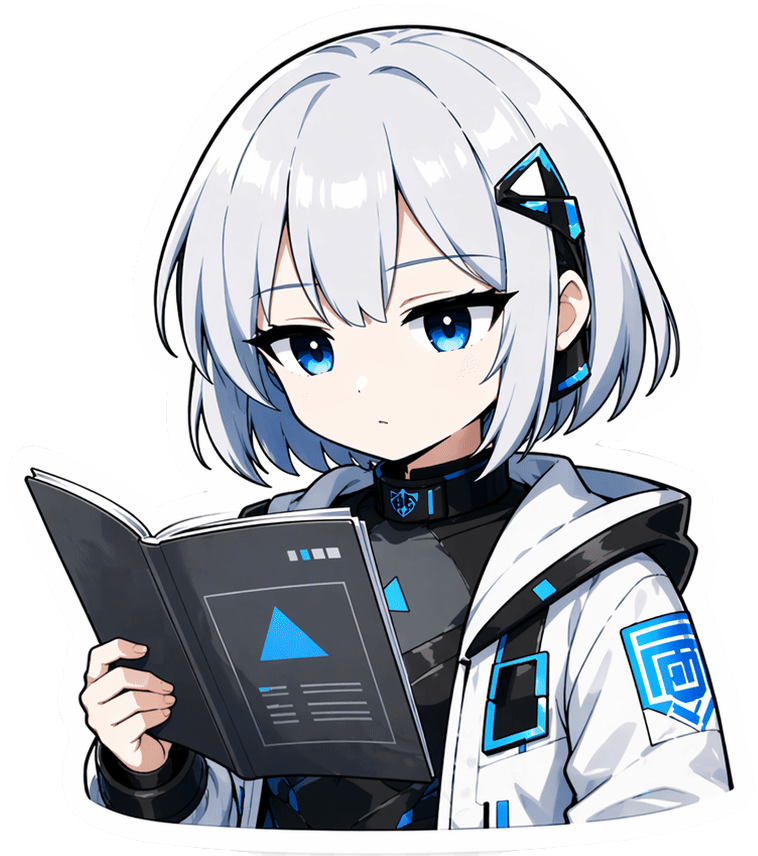 |
| `tool_search` | searching text or paths |  |
| `tool_explore` | browsing folders or structure |  |
| `tool_web` | checking web resources | 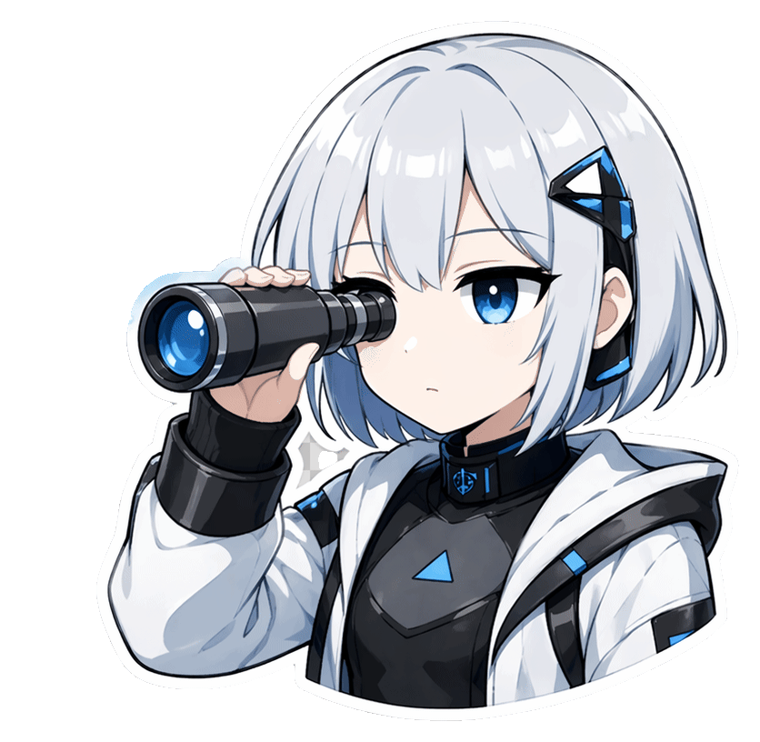 |
| `tool_vcs_read` | reading Git history or diffs | 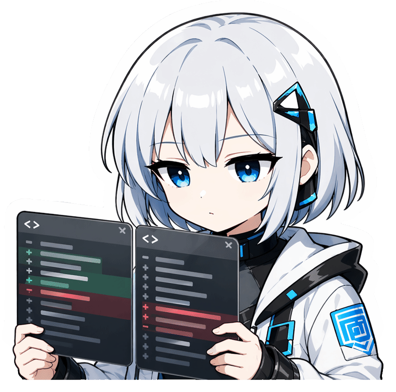 |
| `tool_vcs_write` | writing Git changes | 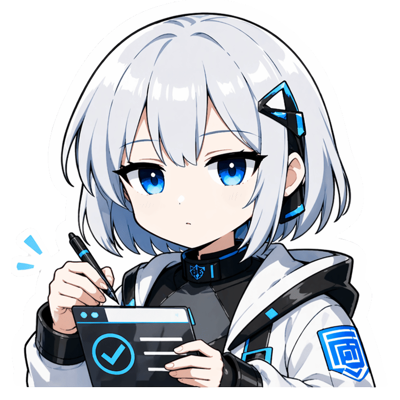 |
| `tool_test` | running tests |  |
| `tool_build` | building or packaging | 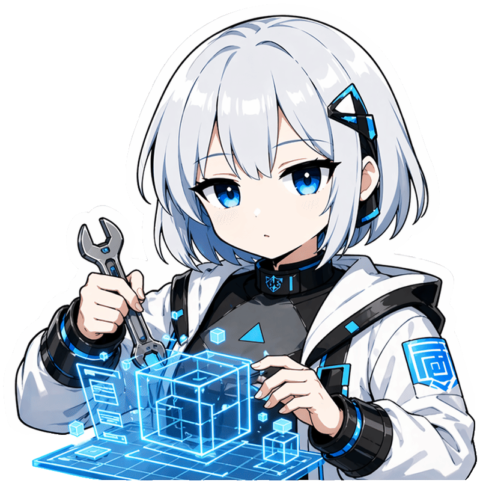 |

### Interaction States

| State | What it means | Preview |
| --- | --- | --- |
| `hover_in` | pointer enters the character area |  |
| `hover_out` | pointer leaves the character area | 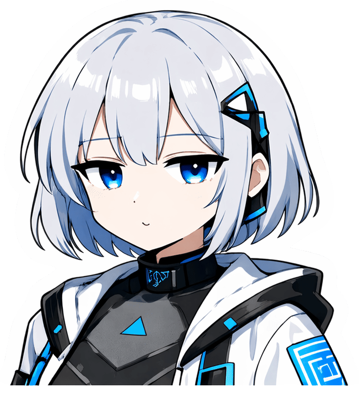 |
| `click` | you click the character | 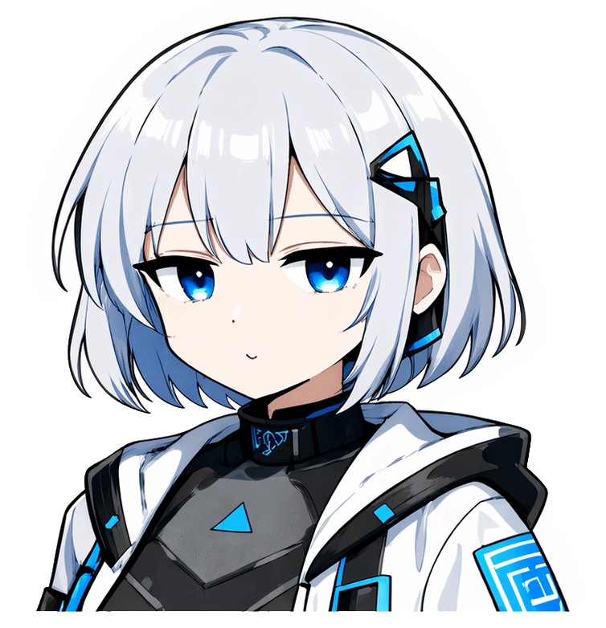 |
| `drag` | generic drag animation when a directional variant is not used | 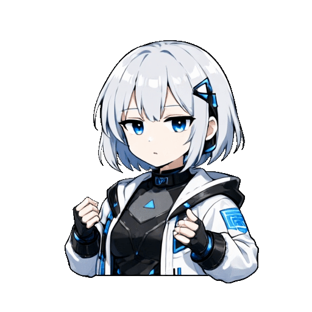 |
| `drag_up` | upward drag variant | 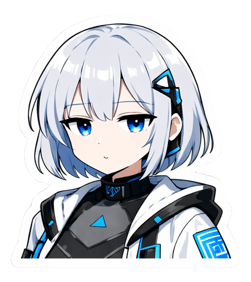 |
| `drag_down` | downward drag variant | 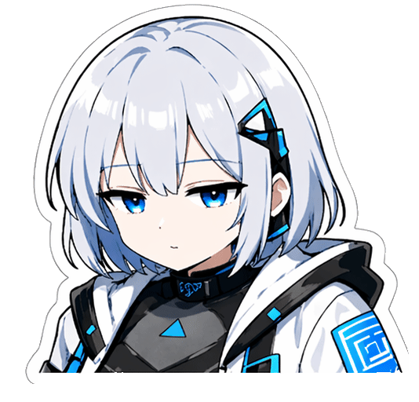 |
| `drag_left` | left drag variant | 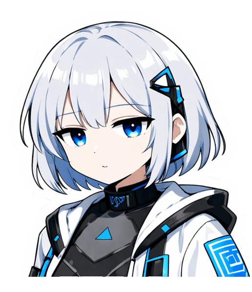 |
| `drag_right` | right drag variant | 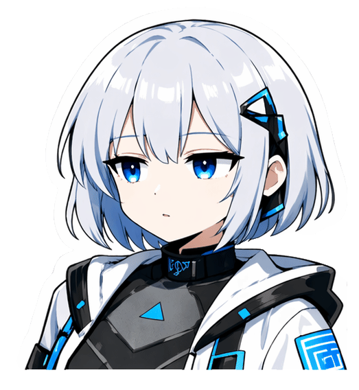 |

### Transition Animations

| Animation | What it means | Preview |
| --- | --- | --- |
| `transition_in` | profile enters the scene before steady-state playback begins | 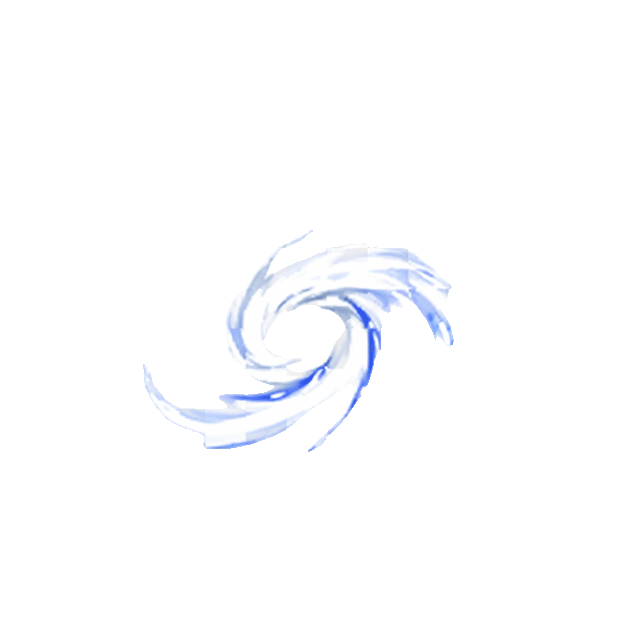 |
| `transition_out` | profile exits the scene when the character is dismissed or hidden | 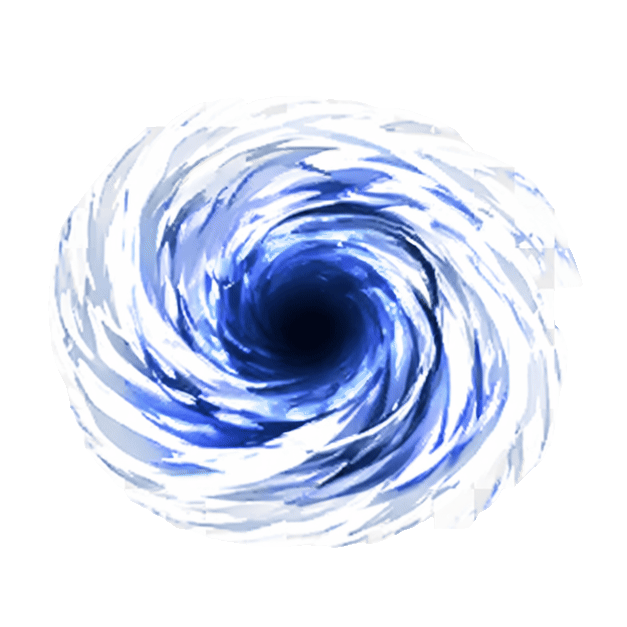 |

The mirrored asset set also includes `tool_bash.gif` for custom or internal profile work, but the user-facing mapping below stays focused on the normalized public states Hooklusion documents today.

## Core Flow

Most sessions look like this:

1. session starts
2. prompt is received
3. the agent thinks
4. a tool becomes active
5. the turn finishes

That maps to these main states:

| State | What it means |
|-------|---------------|
| `session_start` | a session has started or returned |
| `prompt_received` | your prompt was received |
| `thinking` | the agent is waiting or reasoning between events |
| `tool_active` | some tool is currently doing work |
| `done` | the turn completed |

## Tool-Specific States

If the active profile includes more detailed frames, Hooklusion can show more specific activity instead of the generic `tool_active` pose.

| State | Typical meaning |
|-------|------------------|
| `tool_read` | reading files or content |
| `tool_search` | searching text or paths |
| `tool_explore` | browsing folders or structure |
| `tool_web` | checking web resources |
| `tool_vcs_read` | reading Git history or diffs |
| `tool_vcs_write` | writing Git changes |
| `tool_test` | running tests |
| `tool_build` | building or packaging |

## Interaction States

These are separate from LLM hook activity. They describe what happens when you interact with the character window itself.

| State | What it means |
|-------|---------------|
| `hover_in` | pointer enters the character area |
| `hover_out` | pointer leaves the character area |
| `click` | you click the character |
| `drag` | you drag the character |
| `drag_up` | upward drag variant |
| `drag_down` | downward drag variant |
| `drag_left` | left drag variant |
| `drag_right` | right drag variant |

## Claude And Codex

Hooklusion supports both Claude Code and Codex CLI, but they do not expose identical event detail.

In practice:

- both providers support the main session and turn flow
- Claude can often expose richer tool names directly
- Codex can expose non-shell tool states such as `Read`, `Grep`, `Glob`, `Edit`, `Write`, and `WebSearch`
- if Hooklusion cannot infer a more specific tool category, it falls back to `tool_active`

For users, the important part is simple:

- the same profile can work with both providers
- richer profiles look better when more specific states are available
- generic fallback states still keep the character usable even when fine-grained mapping is not available

## Fallback Behavior

Not every profile includes every state. That is normal.

Common fallback behavior:

| Missing state | Fallback |
|---------------|----------|
| `tool_read` | `tool_active` |
| `tool_search` | `tool_active` |
| `tool_explore` | `tool_active` |
| `tool_web` | `tool_active` |
| `tool_vcs_read` | `tool_active` |
| `tool_vcs_write` | `tool_active` |
| `tool_test` | `tool_active` |
| `tool_build` | `tool_active` |
| `tool_active` | `thinking` |

## Prompt And Done Behavior

Two states are worth calling out because they often affect how a profile feels.

- `prompt_received` now stays visible until a later state replaces it
- `done` also stays visible until a later state replaces it
- if `done` uses a non-looping animation and has a `fallbackState`, Hooklusion can return to that fallback after its minimum dwell time

This means the profile's state policy matters more than before. A short dwell produces a quick handoff. A longer dwell keeps the completion pose on screen longer.

This is why even a small sprite set can still feel coherent.

## What To Prioritize In A New Sprite Set

If you are preparing a new character and do not want to draw everything yet, start here:

1. `idle`
2. `session_start`
3. `prompt_received`
4. `thinking`
5. `tool_active`
6. `done`

Then add these next:

1. `tool_read`
2. `tool_search`
3. `tool_explore`
4. `tool_web`
5. `tool_vcs_read`
6. `tool_vcs_write`
7. `tool_test`
8. `tool_build`

## Related Guides

- [Sprite Set Guide](./sprite-set-guide.md)
- [Animation Studio](./animation-studio.md)
- [Glossary](./glossary.md)
